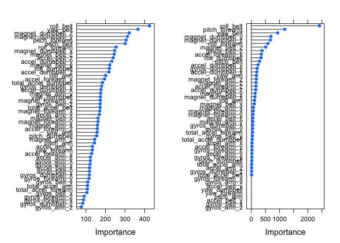

# Prediction of Activity by Performance Measurement
Matthew Gast  
October 2015  

## Background

Quantified self devices collect data on personal activity.  One
limitation of these devices is that users regularly measure the amount
of an activity, but not its quality.  This project uses accelerometer
data from a series of activities done both correctly and incorrectly.

Six subjects in the project were asked to lift barbells in one of five
different ways:

+ Class A: exactly according to the specification
+ Class B: throwing the elbows to the front
+ Class C: lifting the dumbbell only halfway
+ Class D: lowering the dumbbell only halfway
+ Class E: throwing the hips to the front

More information is available from the website here:
http://groupware.les.inf.puc-rio.br/har (see the section on the Weight
Lifting Exercise Dataset).

## Goal

The purpose of this project is to use data to predict the manner in
which the weight lift was performed.  The outcome is the activity
type, stored in the "classe" variable in the training set.

## Load the data


```r
source("prediction.R")
loadPackages()
setConstants()
registerDoParallel(2)
```

Begin by downloading the data and reading it into data structures.
The read functions defined for this project automatically convert
Excel division-by-zero (#DIV/O!") and unavailable values into R's NA
value.


```r
download.pmlfiles(proj.dir)
training.raw <- read.pmlfile("pml-training.csv",proj.dir)
testing.raw <- read.pmlfile("pml-testing.csv",proj.dir)
```

## Clean Data

To clean the data, remove columns with NA values and the metadata
columns.  Metadata columns contain timestamps and bucket numbers that
should not be used in prediction models.  Finally, remove any columns
that have near-zero variance because they lack predictive power.


```r
training.data <- remove.na.cols(training.raw)
training.data <- remove.metadata.cols(training.data)
testing.data <- remove.na.cols(testing.raw)
testing.data <- remove.metadata.cols(testing.data)
nsv.cols <- nearZeroVar (training.data)
if (length(nsv.cols) > 0) {
    training.data <- training.data[-nsv.cols]
}
```

## Cross-Validation

This paper uses 5-fold cross validation, set up with the
`trainControl()` method.  By passing the resulting data structure to
the `train()` function when assessing models, R will automatically
perform resampling and cross-validation.


```r
CV5fold <- trainControl(method="cv",5)
```

As part of model validation, split the data into a training component
and a test component, where the split is controlled by a global
variable.  This paper uses 60% of the data for training, and 40% for
testing, but can be changed easily in the `setConstants()` function.


```r
in.train <- createDataPartition(training.data$classe, p=train.pct, list=FALSE)
train.set <- training.data[in.train,]
test.set <- training.data[-in.train,]
```

## Model building

The dependent variable in the model is a factor, so re-cast the output
of the prediction function as a factor.  In the training data, remove
the dependent variable, which is stored in the last column.


```r
y <- as.factor(train.set$classe)
x <- train.set[-ncol(train.set)]
```

### Random Forest model

The first model assessed is a random forest model, which generally has
good predictive power but can be quite slow.  To improve speed, this
paper was set up to run on a 2-core machine.  Random forests can be
parallelized by using the `parRF` method in the `train()` function.
To include cross-validation, the `trControl` option is set to use
cross-validation.  After building the model, get its accuracy based on
its ability to predict the value for the test data.


```r
model.rf <- train(y~.,data=x,method="parRF",trControl=CV5fold)
rf.test.pred <- predict (model.rf, test.set)
cm.rf <- confusionMatrix(rf.test.pred,test.set$classe)
```

The accuracy for the model is 0.9919704, and the estimated
OOB error is 0.0080296

### Decision tree model

For the second model type, set up a classification tree.  After
building the model, obtain its accuracy on the test data.


```r
model.dt <- rpart(y ~ ., data=x, method="class")
dt.test.pred <- predict(model.dt, test.set, type="class")
cm.dt <- confusionMatrix(dt.test.pred, test.set$classe)
```

Accuracy is 0.7267397, so the estimated
OOB error is 0.2732603

### Boosted model

Finally, consider a generic boosted model, again with a 5-fold cross-validation.


```r
model.gbm <- train(y~.,data=x,method="gbm",trControl=CV5fold)
```

```
## Loading required package: gbm
## Loading required package: survival
## 
## Attaching package: 'survival'
## 
## The following object is masked from 'package:caret':
## 
##     cluster
## 
## Loading required package: splines
## Loaded gbm 2.1.1
## Loading required package: plyr
```

```
## Iter   TrainDeviance   ValidDeviance   StepSize   Improve
##      1        1.6094             nan     0.1000    0.2392
##      2        1.4585             nan     0.1000    0.1576
##      3        1.3582             nan     0.1000    0.1220
##      4        1.2808             nan     0.1000    0.1064
##      5        1.2137             nan     0.1000    0.0873
##      6        1.1579             nan     0.1000    0.0787
##      7        1.1078             nan     0.1000    0.0744
##      8        1.0606             nan     0.1000    0.0666
##      9        1.0193             nan     0.1000    0.0502
##     10        0.9878             nan     0.1000    0.0525
##     20        0.7600             nan     0.1000    0.0255
##     40        0.5302             nan     0.1000    0.0092
##     60        0.4006             nan     0.1000    0.0089
##     80        0.3207             nan     0.1000    0.0061
##    100        0.2637             nan     0.1000    0.0019
##    120        0.2214             nan     0.1000    0.0023
##    140        0.1870             nan     0.1000    0.0008
##    150        0.1749             nan     0.1000    0.0009
```

```r
gbm.test.pred <-predict(model.gbm, test.set)
cm.gbm <- confusionMatrix(gbm.test.pred, test.set$class)
```

Accuracy is 0.961764, so the estimated
OOB error is 0.038236

### Model choice

The random forest and boosted models both have very high accuracy.  To
further compare them, consider the relative importance of the top 20
varables in each model.


```r
varimp.rf.g <- plot(varImp(model.rf,scale=FALSE))
varimp.gbm.g <- plot(varImp(model.gbm,scale=FALSE))
grid.arrange(varimp.rf.g,varimp.gbm.g,ncol=2)
```

 

Both models use the idential top three variables in predictions, and
have similar weights for most variables.  Without strong theoretical
reasons to choose one model over the other, we select the random
forest model because it has slightly better accuracy than the boosted
model.

## Test Data Prediction

As a final step, take the test data and make predictions based on the
random forest model.  Those predictions are then written into the
current working directory and uploaded for the second part of the
project.


```r
test.pred <- predict(model.rf, testing.raw)
pml_write_files(test.pred)
```

